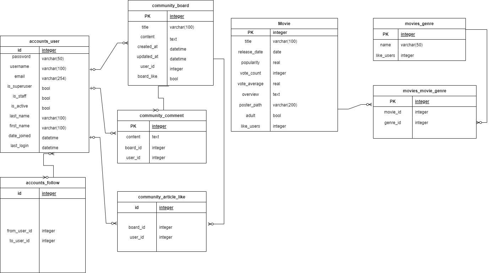

# 11.16 수요일

### 1. 기획

1. 접속시 로그인 / 회원가입시 선호하는 장르 선택 / 로그인 이후 기본 영화목록 출력
   
   1. 내 정보
      1. 기념일(기념일 알림 및 추천?.)

2. 상단 nav바 목록: 내 프로필 / 로그아웃 / 커뮤니티(드롭다운) / 검색창

3. 내부 목록
   
   1. 전체 영화 출력 (조회)
      1. 전체 영화 정보
   2. 가장 인기있는 영화 출력 (조회)
      1. vote_average
   3. 최신 개봉작 (조회)
      1. release_date
   4. 장르별 영화 출력(드롭다운) (조회)
      1. genre별 정보
   5. 나에게 맞는 영화 추천
      1. 회원가입시 기입했던 선호 영화장르
      2. 보고싶은 영화 목록
      3. 좋아하는 감독 / 배우가 출연한 영화
      4. Detail에서 좋아요 를 누른 영화 들 중 
         1. 평점을 가장 높게 준 영화 장르들로 구성하여 추천
            1. 좋아요를 누르는 것이 선결조건
            2. 점수를 주지 않았다면 디폴트로 1
   6. 날짜별 영화 목록 (캘린더 형식)
      1. 년 / 월 / 일 마다 개봉영화를 출력 => 오늘 기준 1년치
         1. 개봉예정인 영화 와 내가 흔적을 남긴 영화 표시(색깔별로), 현재상영중인
      2. 또는 내가 본 영화를 월별로 기록(네이버에 영화 검색 구성)
         1. 예매하기 -> 나중에 볼 영화 추가 / 제거
         2. 리뷰 남기러 ㄱ?

4. 내 관심 목록
   
   1. 최근에 본 영화 글 목록(고민)
   2. 내가 보고싶은 영화 목록
   3. 내가 좋아하는 감독 / 배우 목록
   4. 내가 남긴 리뷰

5. 커뮤니티
   
   1. 프로젝트 해왔던 대로
   2. 유저끼리의 게시글 공유

6. 영화 조회 시
   
   1. 검색창에 검색 후, 검색값과의 정확도 / 이후 평점순으로 출력
      1. 포스터 출력
      2. 제목 / 평점
      3. 장르 / 관람나이
      4. 상영시간 / 관객수
   2. 영화 출력 시
      1. 트레일러 출력
      2. 제목 / 평점
      3. overview
      4. 출연목록
      5. comment(평점 / 한줄평)

7. 추가 생각해볼 것
   
   1. background이미지
      1. 내가 가장 선호하는 장르중 가장 인기있는 영화의 포스터
         1. 가장 인기있는 보다는 그냥 선호하는 장르중에서 top 20의 포스터를 출력
      2. 내가 최근 본 영화의 포스터
      3. 가장 최근에 개봉한 영화 포스터 랜덤 출력
      4. 영화 출력 블록마다의 포스터 별개 출력

8. 내가 좋아요를 누른 영화 장르의 수를 내 프로필에서 출력 => 해당 장르의 영화 추천(막대그래프?)

필요한 정보

- title
- poster_path
- overview
- release_date
- genre_ids
- id
- popularity
- vote_count
- vote_average
- adult
- 

